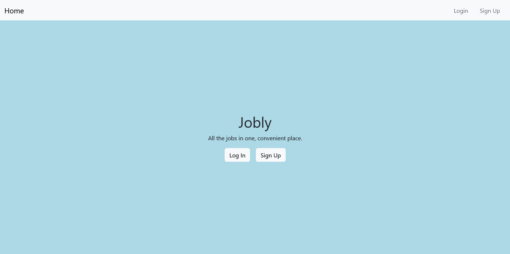
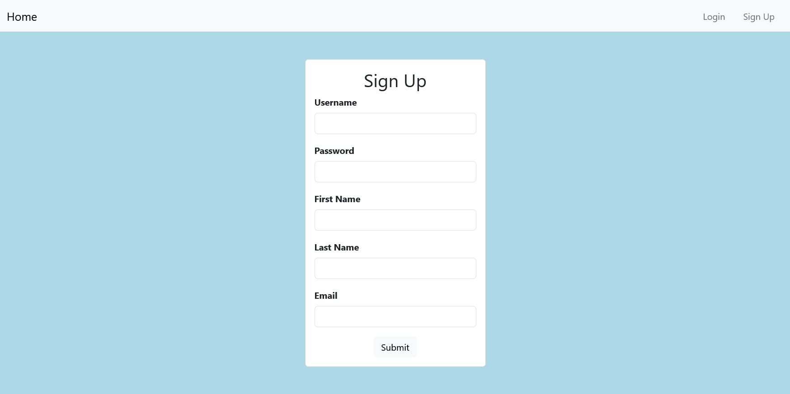
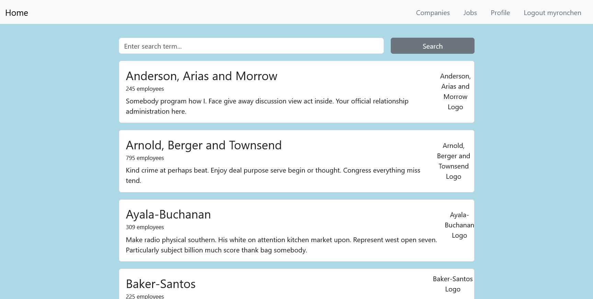
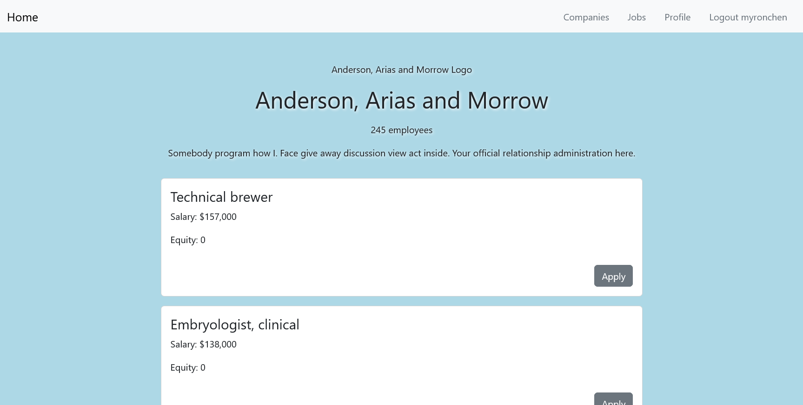
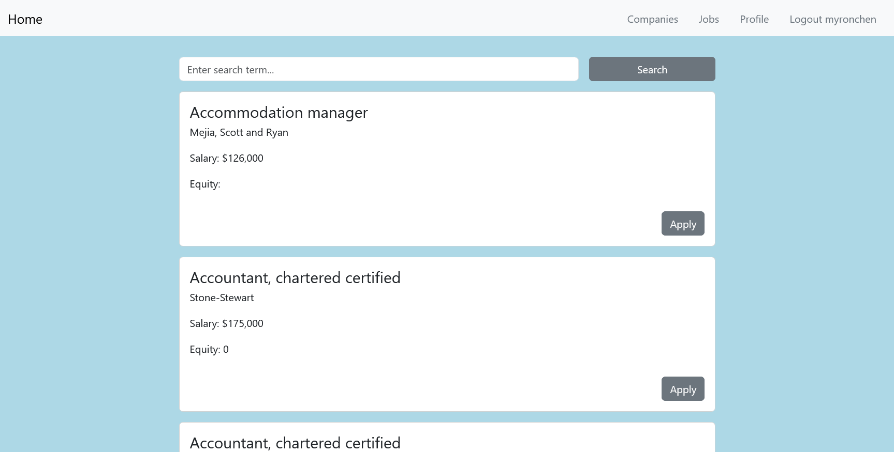

# Jobly (frontend)

https://myron-chen-jobly-frontend.onrender.com

https://github.com/myronchen-git/Springboard-SEC-Unit-41.2-React-Jobly-Frontend

A student project that demonstrates use of React.  A job board website that 
allows for searching and viewing companies, viewing open jobs, and applying to 
jobs.

## Overview

This basic frontend allows users to sign up and sign in to the website.  When 
signed in, users can go to the companies webpage to view the list of all 
companies and filter by name.  Details about a company is given on a company's 
page, along with its job openings.  There is also a webpage that lists all open 
jobs and allows filtering them by name.  A job can be "applied" to, which simply
 saves that status.  Users can update their first name, last name, and email.

## Features

- Lists companies and job openings.

  - Can also search by company name and job name.

- User registration.

- Edit profile page.

- Uses a custom React hook to store user tokens in local storage.

  - This allows the website to remember if a user has previously signed in and 
saves users from having to sign back in after leaving the site.
  
- Protects routes from unauthorized access.

  - Requires users to sign up or sign in before viewing companies and jobs, else
 users will be sent to the landing page.

## Tech Stack

### Frontend

- Vite
- React
- React Router
- axios
- Reactstrap / Bootstrap
- React Testing Library

### Languages

- JavaScript
- HTML
- CSS
